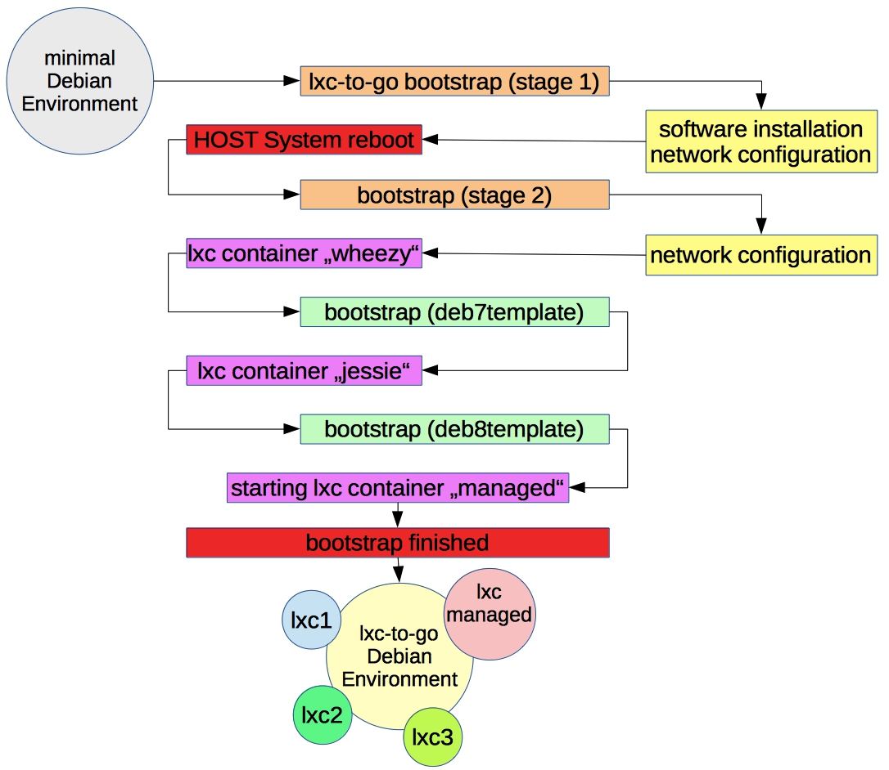
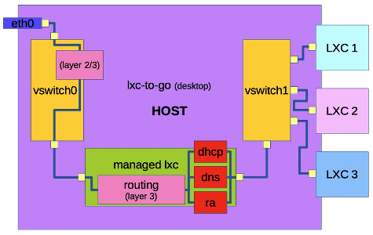
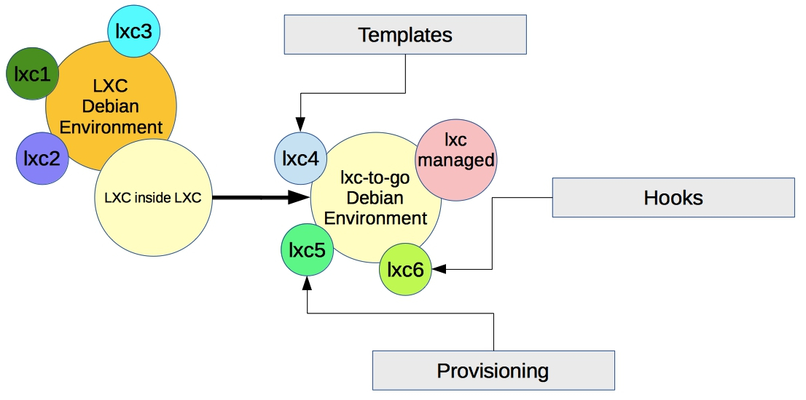
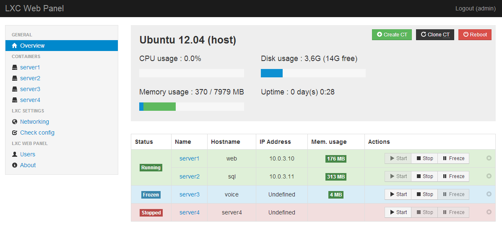

# LXC-to-Go
## (rapid lxc deployment for mobile devices and servers)

- Daniel ([github](https://github.com/plitc))
- Slides & Code: [github.com/plitc/lxc-to-go](https://github.com/plitc/lxc-to-go)


## Konzepte / Motivation (1-8)

- einfache Container Lösung!
 * auch geeignet für Laptops mit wechselnder Netzanbindung

```shell
╭─root at it-daniel in ~ using
╰─○ lxc-to-go

WARNING: lxc-to-go is experimental and its not ready for production. Do it at your own risk.

usage: { bootstrap | start | stop | shutdown | create | delete | show | login | lxc-in-lxc-webpanel | security }

╭─root at it-daniel in ~ using
╰─○
```


## Konzepte / Motivation (2-8)

- einfacher Bootstrap Prozess!

<a href="content/lxc-to-go_schema_.jpg">
   
</a>


## Konzepte / Motivation (3-8)

- Bootstrap Example
 * ~4500 Lines of Bullshit Code  xD

```shell
╭─root at it-daniel in ~ using
╰─○ lxc-to-go bootstrap

[  OK  ] 'optional: fixes for lmde'
WARNING: disable AppArmor on Debian & Ubuntu!
[  OK  ] 'optional: fixes for ubuntu'
[  OK  ] 'optional: fixes for devuan'
[  OK  ] 'optional: debian wheezy upgrade information'
[  OK  ] 'create lxc-to-go directory'
[  OK  ] 'create lxc-to-go/tmp directory'
[  OK  ] 'copy hook_provisioning.sh'
[  OK  ] 'copy template.func.sh'
[  OK  ] 'lxc-to-go environment configcheck'
[  OK  ] 'lxc-to-go interface configcheck'
[  OK  ] 'lxc-to-go btrfs configcheck'
[  OK  ] 'look over cgmanager'
Synchronizing state of cgmanager.service with SysV service script with /lib/systemd/systemd-sysv-install.
Executing: /lib/systemd/systemd-sysv-install enable cgmanager
[  OK  ] 'look over cgmanager'
[  OK  ] 'look over screen'
[  OK  ] 'look over iptables'
[  OK  ] 'look over ip6tables'
[  OK  ] 'look over lxc'
[  OK  ] 'look over debootstrap'
[  OK  ] 'lxc template - wheezy configcheck'
[  OK  ] 'look over bridge-utils'
[  OK  ] 'look over net-tools'
Kernel configuration not found at /proc/config.gz; searching...
Kernel configuration found at /boot/config-4.16.0-2-amd64
--- Namespaces ---
Namespaces: enabled
Utsname namespace: enabled
Ipc namespace: enabled
Pid namespace: enabled
User namespace: enabled
Network namespace: enabled

--- Control groups ---
Cgroups: enabled

Cgroup v1 mount points:
/sys/fs/cgroup/systemd
/sys/fs/cgroup/net_cls,net_prio
/sys/fs/cgroup/blkio
/sys/fs/cgroup/devices
/sys/fs/cgroup/memory
/sys/fs/cgroup/pids
/sys/fs/cgroup/cpu,cpuacct
/sys/fs/cgroup/perf_event
/sys/fs/cgroup/cpuset
/sys/fs/cgroup/freezer

Cgroup v2 mount points:
/sys/fs/cgroup/unified

Cgroup v1 clone_children flag: enabled
Cgroup device: enabled
Cgroup sched: enabled
Cgroup cpu account: enabled
Cgroup memory controller: enabled
Cgroup cpuset: enabled

--- Misc ---
Veth pair device: enabled, loaded
Macvlan: enabled, not loaded
Vlan: enabled, not loaded
Bridges: enabled, loaded
Advanced netfilter: enabled, not loaded
CONFIG_NF_NAT_IPV4: enabled, loaded
CONFIG_NF_NAT_IPV6: enabled, loaded
CONFIG_IP_NF_TARGET_MASQUERADE: enabled, loaded
CONFIG_IP6_NF_TARGET_MASQUERADE: enabled, loaded
CONFIG_NETFILTER_XT_TARGET_CHECKSUM: enabled, not loadedCONFIG_NETFILTER_XT_MATCH_COMMENT: enabled, not loaded
FUSE (for use with lxcfs): enabled, loaded

--- Checkpoint/Restore ---
checkpoint restore: enabled
CONFIG_FHANDLE: enabled
CONFIG_EVENTFD: enabled
CONFIG_EPOLL: enabled
CONFIG_UNIX_DIAG: enabled
CONFIG_INET_DIAG: enabled
CONFIG_PACKET_DIAG: enabled
CONFIG_NETLINK_DIAG: enabled
File capabilities: enabled

Note : Before booting a new kernel, you can check its configuration
usage : CONFIG=/path/to/config /usr/bin/lxc-checkconfig

[  OK  ] 'optional: wheezy kernel upgrade'
[  OK  ] 'optional: wheezy lxc upgrade'
[  OK  ] 'grub configcheck'
[  OK  ] 'optional: powerpc / travis-ci environment configcheck'
[  OK  ] 'modprobe: iptables/nf_nat'
[  OK  ] 'prepare bridge zones - stage 1'
[  OK  ] 'prepare bridge zones - stage 2'
[  OK  ] 'prepare bridge zones - stage 3'
[  OK  ] 'lxc: managed bootstrap - stage 1'
[  OK  ] 'lxc: managed bootstrap - stage 2'
[  OK  ] 'configure host sysctl'
[  OK  ] 'optional: fixes for ubuntu'
[  OK  ] 'lxc: deb7template'
... LXC Container (screen session: ): always running ...
[  OK  ] 'lxc: managed bootstrap - stage 3'
[  OK  ] 'lxc: managed upgrade - stage 1'
[  OK  ] 'lxc: managed upgrade - stage 2'
[  OK  ] 'lxc: managed look over iptables'
[  OK  ] 'lxc: managed sysctl'
[  OK  ] 'lxc: managed rc.local'
[  OK  ] 'lxc: managed network settings'
[  OK  ] 'lxc: managed look over less'
[  OK  ] 'lxc: managed look over isc-dhcp-server'
[  OK  ] 'lxc: managed isc-dhcp-server configcheck'
[  OK  ] 'lxc: managed look over unbound'
[  OK  ] 'lxc: managed unbound configcheck'
[  OK  ] 'lxc: managed look over radvd'
[  OK  ] 'lxc: managed radvd configcheck'
[  OK  ] 'lxc: managed look over iputils-ping'
[  OK  ] 'lxc: managed look over traceroute'
[  OK  ] 'lxc: managed look over dnsutils'
[  OK  ] 'lxc: managed look over mtr-tiny'
[  OK  ] 'prepare bridge zones - stage 4'
[  OK  ] 'prepare bridge zones - stage 5'
[  OK  ] 'configure rp_filter sysctl'
[  OK  ] 'configure lxc-to-go symlinks - stage 1'
[  OK  ] 'configure lxc-to-go symlinks - stage 2'
[  OK  ] 'configure lxc-to-go etc/hosts entry'
[ INFO ] PulseAudio maybe listen on (vswitch0) Port 4713 now!
[  OK  ] 'optional: prepare lxc x11 video / audio environment'

● isc-dhcp-server.service - LSB: DHCP server
   Loaded: loaded (/etc/init.d/isc-dhcp-server)

[  OK  ] 'lxc: managed isc-dhcp-server'

● unbound.service
   Loaded: loaded (/etc/init.d/unbound)

[  OK  ] 'lxc: managed unbound'

● radvd.service - LSB: Router Advertising Daemon
   Loaded: loaded (/etc/init.d/radvd)

[  OK  ] 'lxc: managed radvd'

[  OK  ] 'optional: sysctl for unprivileged containers'
[  OK  ] 'optional: load fuse module for unprivileged containers'
fs.file-max = 99000000
[  OK  ] 'optional: file-max support up to 99 lxc'
[  OK  ] 'clean up tmp files'

lxc-to-go bootstrap finished.
╭─root at it-daniel in ~ using
╰─○
```


## Konzepte / Motivation (4-8)

- erstellt einen Managed Container!
 * für DHCP, DNS & RA Service

- automatische NAT Portforwarding Regeln für interne LXCs
 * IPv4 192.168.254.xxx/24 & IPv6 fd00:xxxx/64

<a href="content/lxc-to-go_desktop_.jpg">
   
</a>


## Konzepte / Motivation (5-8)

- App Container Templates!

<a href="content/lxc-to-go_inside_.jpg">
   
</a>


## Konzepte / Motivation (6-8)

- App Container Templates Example
* like Docker Hub  *(^_^)*

```shell
╭─daniel at it-daniel in /github/lxc-to-go/hooks/templates on master✔ using
╰─± find

.
./com.docker
./com.docker_lxcdriver
./com.docker_x11gui
./com.github.ether.etherpad-lite.DEV.dirtydb
./com.github.ether.etherpad-lite.RELEASE.dirtydb
./com.github.ether.etherpad-lite.dirtydb
./com.github.ether.etherpad-lite.mariadb
./com.github.ether.etherpad-lite.mariadb-utf8mb4
./com.github.letsencrypt
./com.github.plitc.flower
./com.github.santex.ai-microstructure
./com.github.santex.flower
./com.gitlab.communityedition
./com.steampowered_x11gui_3d
./com.sublimetext_x11gui
./eu.plitc.connect.dn42
./org.mupen64plus
./org.openwrt.freeradius.anonymous-eap-ttls
./org.openwrt.freeradius.public
./org.owncloud.mysql
./org.redmine.mariadb
./org.samba.simple
./plain.provisioning
./plain.provisioning_x11gui
./plain.provisioning_x11gui_3d
./plain.provisioning_x11gui_browser

╭─daniel at it-daniel in /github/lxc-to-go/hooks/templates on master✔ using
╰─±
```


## Konzepte / Motivation (7-8)

- Nested LXC / LXC-inside-LXC Container Webpanel
 * für Wegwerf inside LXC, Docker Container

<a href="content/lxcwebpanel.png">
   
</a>


## Konzepte / Motivation (8-8)

- PulseAudio Control der internen LXCs
- Graphics Acceleration in internen LXCs

[](https://www.youtube.com/watch?v=tERKMfnBKsY)


## Viel Spaß mit LXC-to-Go

- https://github.com/plitc/lxc-to-go

